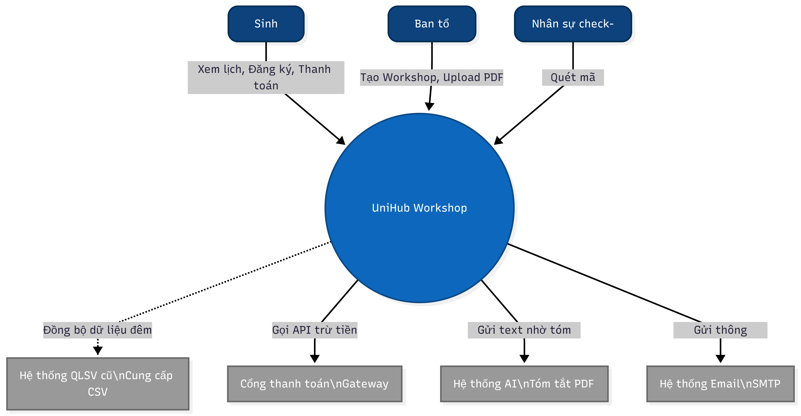
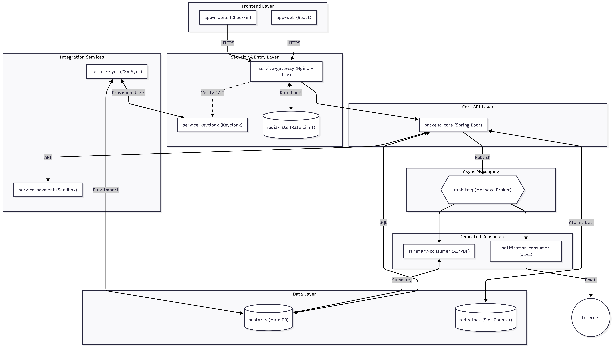
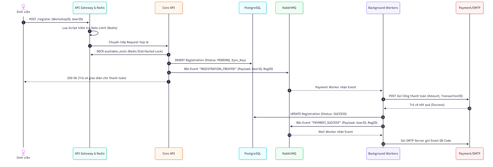
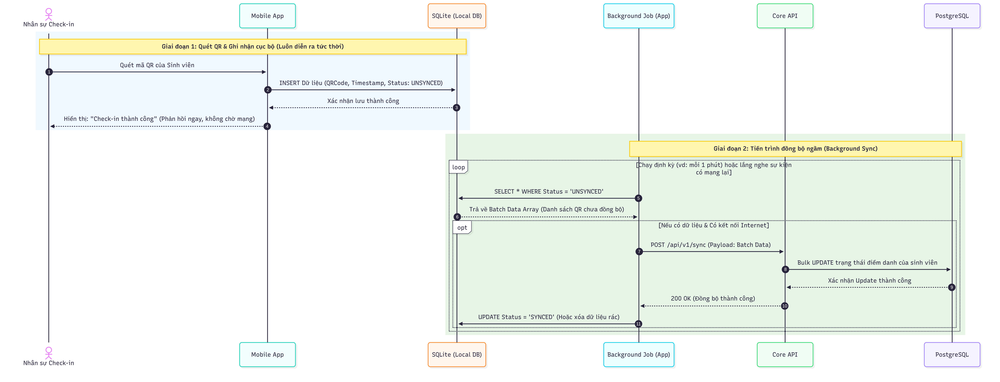
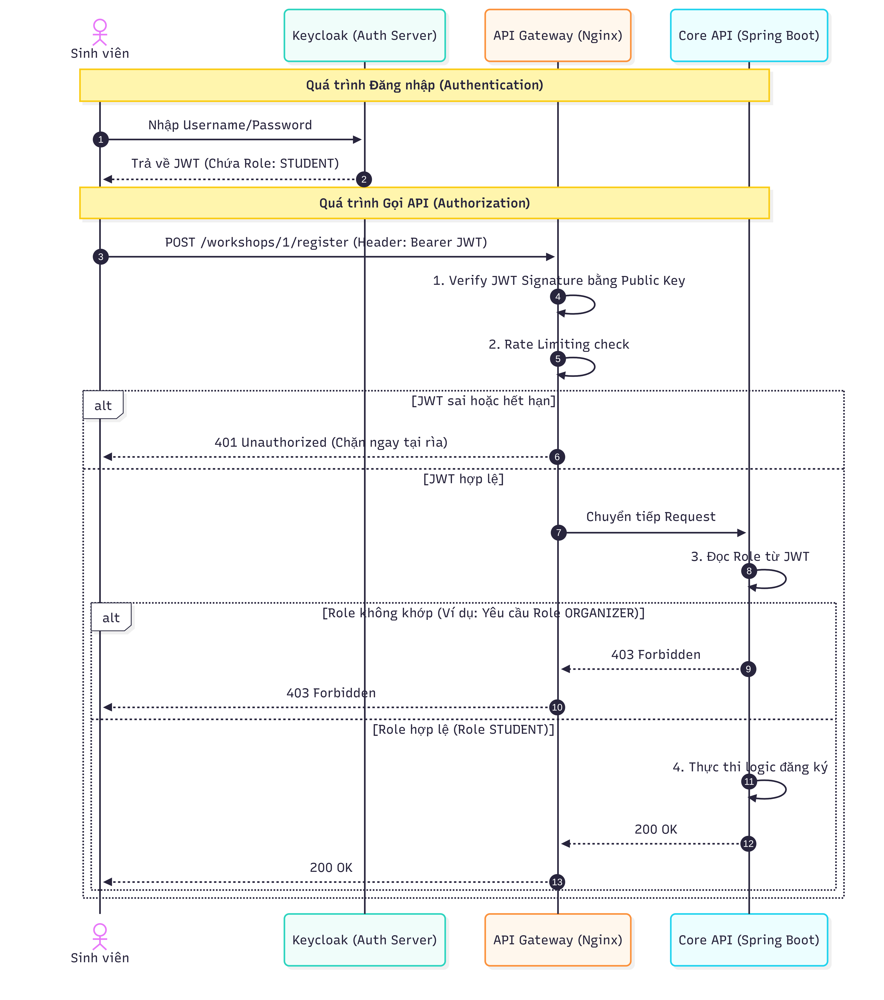

# UniHub Workshop — Technical Design

## Kiến trúc tổng thể

Hệ thống UniHub Workshop được thiết kế theo mô hình **Event-Driven Microservices (Vi dịch vụ hướng sự kiện)** kết hợp với **API Gateway Pattern**. Khác với kiến trúc Monolithic (nguyên khối) truyền thống, kiến trúc này phân rã hệ thống thành các dịch vụ độc lập, giao tiếp với nhau chủ yếu thông qua các luồng sự kiện bất đồng bộ.

### 1. Lý do lựa chọn kiến trúc
Kiến trúc này được lựa chọn nhằm giải quyết trực diện 3 rủi ro lớn nhất của dự án:
* **Khả năng chịu tải đột biến (High Scalability):** Với yêu cầu 12.000 sinh viên truy cập trong 10 phút đầu, mô hình API Gateway cho phép thiết lập "lá chắn" Rate Limiting ở rìa hệ thống. Hệ thống có thể mở rộng độc lập (scale up/out) chỉ riêng cụm xử lý Đăng ký mà không cần scale các tính năng khác.
* **Khả năng chịu lỗi và Cách ly rủi ro (Fault Tolerance & Isolation):** Bằng cách áp dụng giao tiếp bất đồng bộ qua Message Broker, nếu các hệ thống bên ngoài (Cổng thanh toán, Email Server, Hệ thống AI) bị chậm hoặc sập, luồng đăng ký chính của sinh viên vẫn không bị treo (Cascading Failure).
* **Xử lý nền hiệu quả (Background Processing):** Các tác vụ nặng và dễ gây lỗi như xử lý file CSV ban đêm hay bóc tách văn bản PDF bằng AI được đẩy sang các Worker chạy ngầm, đảm bảo luồng API phục vụ người dùng luôn đạt độ trễ thấp nhất.

### 2. Các thành phần chính và Vai trò
Hệ thống được cấu thành từ 7 khối chính:

* **Client Apps (Web/Mobile):** * Web App phục vụ sinh viên (đăng ký) và ban tổ chức (quản trị).
  * Mobile App dành riêng cho nhân sự check-in, được tích hợp Local Database (SQLite) để lưu trữ JWT và dữ liệu quét QR tạm thời khi hoạt động ở chế độ Offline (mất mạng).
* **API Gateway (Nginx + Lua + Redis):** Đóng vai trò là điểm truy cập duy nhất (Single Entry Point) của toàn bộ hệ thống. Nhiệm vụ chính là định tuyến (Routing), chặn các request có JWT không hợp lệ (xác thực sơ bộ), và quan trọng nhất là kết hợp với Redis để thực thi thuật toán phân luồng/giới hạn tốc độ (Rate Limiting) bảo vệ Backend.
* **Identity Provider (Keycloak):** Quản lý định danh người dùng tập trung. Cấp phát Access Token (JWT). Keycloak hoạt động độc lập và không tham gia vào luồng gọi API hàng ngày của Backend, giúp triệt tiêu điểm nghẽn cổ chai (Bottleneck).
* **Core API / Backend (Spring Boot):** Xử lý logic nghiệp vụ chính (xem danh sách, thao tác đăng ký, xác nhận quyền). Backend là các dịch vụ phi trạng thái (Stateless), xác minh JWT thông qua Public Key (đã cache). **Quan trọng:** Core API không ghi trực tiếp vào PostgreSQL trong luồng đăng ký — thay vào đó, nó publish event vào RabbitMQ để Registration Worker xử lý ghi dữ liệu theo lô (Bulk Write), tránh làm cạn kiệt Connection Pool của DB khi tải cao.
* **Message Broker (RabbitMQ):** Xương sống của hệ thống giao tiếp bất đồng bộ. Đóng vai trò như một "bưu điện" nhận các sự kiện từ Core API (ví dụ: `Registration_Created`, `Payment_Pending`, `Process_PDF_Requested`, `Checkin_Sync_Requested`) và đưa vào các hàng đợi (Queues).
* **Background Workers (Spring Boot):** Các dịch vụ không nhận HTTP Request, chỉ âm thầm lắng nghe từ RabbitMQ để xử lý các công việc nặng:
  * *Registration Worker:* Nhận event `Registration_Created`, gom theo lô và thực hiện Bulk INSERT vào PostgreSQL, giảm tải Connection Pool khi có hàng nghìn đăng ký đồng thời.
  * *Recovery Worker:* Chạy theo lịch (mỗi 15 giây), scan Redis tìm các Reservation Token đã hết TTL — retry ghi DB nếu chưa có record (giữ chỗ cho user), hoặc hoàn trả slot nếu user bỏ cuộc.
  * *Payment Worker:* Gọi API sang Cổng thanh toán (tích hợp Circuit Breaker).
  * *Notification Worker:* Gửi Email/App Notification.
  * *Integration Worker:* Đọc và đồng bộ file CSV, gọi API hệ thống AI.
* **Data Layer (PostgreSQL & Redis):**
  * *PostgreSQL:* Cơ sở dữ liệu quan hệ, đảm bảo tính nhất quán (ACID) cho dữ liệu bền vững (thông tin user, cấu hình workshop, lịch sử giao dịch).
  * *Redis (2 cluster tách biệt):*
    * `redis-rate`: Phục vụ Rate Limiting tại API Gateway (Token Bucket counters). Có thể mất data khi restart — chỉ là bộ đếm, rebuild tự động.
    * `redis-lock`: Phục vụ Slot Counter (`DECR`), Reservation Token và Distributed Lock. Không dùng RDB snapshot trong giờ peak; chỉ dùng AOF để đảm bảo bền vững.

### 3. Mô hình giao tiếp giữa các thành phần
Để đảm bảo hiệu năng, hệ thống áp dụng hai mô hình giao tiếp song song:
* **Giao tiếp Đồng bộ (Synchronous - RESTful):** Dành riêng cho luồng **Client <-> API Gateway <-> Core API**. Sinh viên bấm đăng ký, hệ thống giữ chỗ thành công bằng Redis và trả về kết quả ngay lập tức (độ trễ mili-giây).
* **Giao tiếp Bất đồng bộ (Asynchronous - Event-driven):** Dành cho luồng **Core API -> RabbitMQ -> Workers -> External Systems**. Sau khi trả kết quả cho sinh viên, Core API bắn event vào RabbitMQ. Việc gọi qua Cổng thanh toán hay gửi Email được các Workers xử lý phía sau. Nếu lỗi, message được đẩy vào hàng đợi lỗi (Dead Letter Queue) để thử lại sau.
    
## C4 Diagram

Để thể hiện kiến trúc hệ thống một cách trực quan, dự án sử dụng mô hình C4 (Context, Containers, Components, Code). Dưới đây là hai cấp độ tổng quan nhất của hệ thống.

### Level 1 — System Context
Sơ đồ System Context (Bối cảnh hệ thống) thể hiện bức tranh toàn cảnh: Hệ thống UniHub Workshop nằm ở trung tâm, bao quanh là những người sử dụng (Actors) và các hệ thống bên ngoài (External Systems) mà nó cần tương tác.

**Mô tả các thành phần:**
* **Người dùng (Actors):**
  * *Sinh viên:* Xem lịch, đăng ký, thanh toán và nhận QR code.
  * *Ban tổ chức:* Quản lý workshop, xem thống kê, upload tài liệu PDF.
  * *Nhân sự check-in:* Quét mã QR tại sự kiện, hoạt động ngay cả khi không có mạng.
* **Hệ thống trung tâm:** UniHub Workshop System.
* **Hệ thống ngoài (External Systems):**
  * *Hệ thống QLSV cũ:* Nguồn cung cấp dữ liệu sinh viên định kỳ qua file CSV.
  * *Cổng thanh toán (Payment Gateway):* Xử lý giao dịch trừ tiền.
  * *Hệ thống AI (AI Provider):* Xử lý và tóm tắt file PDF thành văn bản ngắn gọn.
  * *Hệ thống Email (SMTP Provider):* Gửi email thông báo, vé QR cho sinh viên.

**Sơ đồ (Mermaid):**


### Level 2 — Container

Sơ đồ Container phân rã hệ thống "UniHub Workshop" thành các khối có thể triển khai độc lập (deployable units) như Web, App, Database, API. Sơ đồ này làm rõ cách các công nghệ giao tiếp với nhau để giải quyết bài toán tải cao và tích hợp.

**Mô tả các Container chính:**

1. **Frontend Layer:**
   * **Web App (React/Vue):** Giao diện cho Sinh viên và Ban tổ chức. Tương tác với hệ thống qua HTTPS/REST.
   * **Mobile App (Android/iOS):** Ứng dụng quét QR cho nhân sự. Chứa SQLite (Local DB) để lưu trữ JWT và dữ liệu check-in tạm thời khi mất kết nối mạng.

2. **Gateway & Auth Layer:**
   * **API Gateway (Nginx + Lua):** Chặn đầu vào, thực hiện Rate Limiting bằng Redis để bảo vệ hệ thống khỏi tải đột biến 12.000 requests.
   * **Auth Server (Keycloak):** Cấp phát JWT. Gateway và Backend chỉ cần lấy Public Key để tự xác thực mà không cần gọi liên tục về Keycloak.

3. **Core Backend & Data Layer:**
   * **Core API (Spring Boot):** Xử lý nghiệp vụ chính (đăng ký, cấp chỗ). Giao tiếp với Redis để sử dụng Distributed Lock giải quyết tranh chấp chỗ ngồi, và ghi dữ liệu bền vững xuống PostgreSQL.

4. **Asynchronous & Integration Layer:**
   * **Message Broker (RabbitMQ):** Nhận các sự kiện (event) từ Core API để giảm tải.
   * **Background Workers (Spring Boot):** Các service chạy ngầm, kéo message từ RabbitMQ để xử lý chậm (Gửi Email, Gọi AI tóm tắt PDF, Gọi Cổng thanh toán Retry, Đồng bộ CSV ban đêm).

**Sơ đồ (Mermaid):**


## High-Level Architecture Diagram
## High-Level Architecture Diagram

Phần này tập trung đặc tả các luồng dữ liệu (Data Flow) quan trọng nhất của hệ thống, minh họa cách dữ liệu di chuyển, thay đổi trạng thái và được xử lý qua các thành phần tại những điểm nút thắt về tải và tích hợp.

### 1. Luồng dữ liệu Đăng ký có phí & Xử lý bất đồng bộ
Sơ đồ thể hiện cách luồng dữ liệu đăng ký được cắt nhánh: phản hồi nhanh cho sinh viên (Sync) và đẩy phần dữ liệu giao dịch tài chính, thông báo cho hệ thống nền xử lý (Async) nhằm tránh treo ứng dụng.

**Sơ đồ (Mermaid):**


### 2. Luồng dữ liệu Check-in Offline (Offline-First / Store & Forward)
Hệ thống áp dụng kiến trúc **Offline-First**. Để đảm bảo tốc độ quét QR nhanh nhất tại sự kiện, Mobile App không bao giờ gọi trực tiếp lên Server khi quét. Dữ liệu luôn được lưu vào CSDL cục bộ (SQLite) ngay lập tức, và một tiến trình ngầm (Background Job) sẽ chịu trách nhiệm đồng bộ hóa với Server khi có kết nối Internet.

**Sơ đồ (Mermaid):**


## Thiết kế cơ sở dữ liệu

Hệ thống áp dụng chiến lược **Polyglot Persistence** (sử dụng nhiều loại cơ sở dữ liệu khác nhau) để tối ưu hóa cho từng mục đích cụ thể: Đảm bảo toàn vẹn dữ liệu tài chính, xử lý tranh chấp tốc độ cao và hỗ trợ hoạt động ngoại tuyến.

### 1. Phân tích và Lựa chọn Database

| Loại Database | Công nghệ được chọn | Vai trò trong hệ thống | Lý do lựa chọn |
| :--- | :--- | :--- | :--- |
| **Relational DB (SQL)** | **PostgreSQL** | Cơ sở dữ liệu chính (Primary DB) lưu trữ thông tin user, workshop, vé và giao dịch. | Đảm bảo tính ACID tuyệt đối cho các giao dịch tài chính. Hỗ trợ tốt kiểu dữ liệu JSONB để lưu trữ kết quả tóm tắt linh hoạt từ AI. |
| **In-memory DB (NoSQL)** | **Redis** | Lưu cache, đếm Rate Limit và quản lý Distributed Lock. | Tốc độ đọc/ghi độ trễ mili-giây. Các thao tác Atomic (`INCR`, `DECR`) của Redis là giải pháp hoàn hảo để trừ số lượng chỗ trống (slots) khi có hàng ngàn request ập vào cùng lúc mà không làm sập DB chính. |
| **Embedded DB** | **SQLite** | CSDL cục bộ trên Mobile App của nhân sự check-in. | Gọn nhẹ, hoạt động hoàn toàn offline. Giúp lưu trữ mã QR và thời gian quét ngay lập tức khi thiết bị mất kết nối mạng. |

---

### 2. Sơ đồ Thực thể Liên kết (ERD - PostgreSQL)

Sơ đồ dưới đây thể hiện mối quan hệ giữa các Entity chính trong hệ thống Core.

**Sơ đồ (Mermaid):**

### 3. Chi tiết Schema các Entity quan trọng

**Bảng `WORKSHOPS`**
* Là bảng chịu tải đọc (Read-heavy) nhiều nhất trước khi sự kiện diễn ra.
* **Lưu ý kỹ thuật:** Trường `available_slots` sẽ không bị update liên tục bởi từng request đăng ký (để tránh thắt cổ chai). Việc trừ slot diễn ra trên Redis. Chỉ khi có sự chênh lệch (đăng ký thành công hoặc timeout hủy vé), Worker mới update lại trường `available_slots` này để đồng bộ.

**Bảng `REGISTRATIONS` (Đăng ký / Vé)**
* Đóng vai trò là Entity trung tâm kết nối Sinh viên và Workshop.
* **Trường `qr_code`:** Chứa chuỗi hash độc nhất được sinh ra sau khi trạng thái chuyển sang `SUCCESS`. Đây là chuỗi được render thành hình ảnh QR trên App/Email.
* **Trường `status`:** * `PENDING`: Đã giữ chỗ thành công trên Redis, đang chờ thanh toán.
    * `SUCCESS`: Thanh toán thành công (hoặc workshop miễn phí).
    * `FAILED`: Thanh toán thất bại hoặc quá thời gian chờ (Timeout).
    * `CHECKED_IN`: Sinh viên đã có mặt và được quét mã.

**Bảng `TRANSACTIONS` (Giao dịch)**
* **Thiết kế then chốt:** Trường `idempotency_key` được set là `UNIQUE`. Khi client gửi request thanh toán, mã này được sinh ra từ đầu. Nếu cổng thanh toán timeout và client retry, hệ thống sẽ chặn lại nhờ ràng buộc Unique này, đảm bảo không bao giờ xảy ra lỗi trừ tiền hai lần.

### 4. Schema trên Mobile App (SQLite - Offline Mode)

Bảng `OFFLINE_CHECKINS` được lưu cục bộ trên điện thoại của nhân sự để phục vụ cơ chế Store & Forward.

| Trường dữ liệu | Kiểu dữ liệu | Ràng buộc | Ý nghĩa |
| :--- | :--- | :--- | :--- |
| `id` | Integer | PK, Auto Increment | ID nội bộ trên thiết bị |
| `scanned_qr_code` | String | Not Null | Mã QR trích xuất từ camera |
| `scanned_at` | DateTime | Not Null | Thời điểm quét thực tế (Timestamp) |
| `sync_status` | String | Default 'UNSYNCED' | Trạng thái đồng bộ: `UNSYNCED` hoặc `SYNCED` |

## Thiết kế kiểm soát truy cập

Hệ thống áp dụng mô hình phân quyền **RBAC (Role-Based Access Control)** kết hợp với chuẩn xác thực **OAuth 2.0 / OpenID Connect**, được quản lý tập trung bởi **Keycloak**. Việc phân quyền dựa trên cơ chế Stateless (phi trạng thái) sử dụng JSON Web Token (JWT) để đảm bảo hiệu năng cao khi chịu tải đột biến.

### 1. Các nhóm người dùng và Quyền hạn (Roles & Permissions)

| Nhóm người dùng (Role) | Mô tả vai trò | Quyền hạn trên hệ thống (Permissions) |
| :--- | :--- | :--- |
| **`STUDENT`** (Sinh viên) | Người tham dự sự kiện. | - Xem danh sách và chi tiết workshop.<br>- Đăng ký/Hủy đăng ký workshop.<br>- Xem lịch sử đăng ký và mã QR của chính mình. |
| **`ORGANIZER`** (Ban tổ chức) | Quản trị viên hệ thống. | - Toàn quyền (CRUD) quản lý Workshop.<br>- Tải lên file PDF để AI tóm tắt.<br>- Xem thống kê số lượng đăng ký/check-in. |
| **`CHECKIN_STAFF`** (Nhân sự check-in) | Cộng tác viên trực tại các phòng. | - Đăng nhập vào Mobile App.<br>- Gọi API đồng bộ dữ liệu điểm danh (`/api/v1/sync`). Không có quyền truy cập dữ liệu hệ thống. |

### 2. Cách kiểm tra quyền tại từng điểm truy cập (Authorization Flow)

Hệ thống thiết lập **3 lớp phòng thủ** độc lập để kiểm soát truy cập từ ngoài vào trong:

#### Lớp 1: Tại Client (Web App / Mobile App)
* **Cơ chế:** Khi đăng nhập thành công qua Keycloak, Client nhận được một Access Token (JWT). Client sẽ tự giải mã payload của JWT này để đọc danh sách `roles`.
* **Hành động:** Dựa vào Role, UI sẽ ẩn/hiện các menu chức năng tương ứng (Ví dụ: Sinh viên sẽ không nhìn thấy nút "Tạo Workshop", nhân sự check-in chỉ thấy màn hình quét Camera). Điều này giúp cải thiện UX nhưng không mang tính bảo mật tuyệt đối.

#### Lớp 2: Tại API Gateway (Nginx + Lua) - Chốt chặn vòng ngoài
* **Cơ chế:** Nginx đóng vai trò là lính gác cổng. Mọi request muốn đi vào Backend đều phải có header `Authorization: Bearer <JWT>`. Nginx sử dụng Lua script kết hợp với Public Key của Keycloak (được cache trong Redis) để kiểm tra tính hợp lệ sơ bộ của Token.
* **Hành động:** * Nginx kiểm tra: Token có bị giả mạo chữ ký không? Token đã hết hạn chưa (`exp` claim)?
  * Nếu không hợp lệ: Gateway lập tức chặn request và trả về mã **`401 Unauthorized`** mà không cần gọi vào Backend, giúp bảo vệ Spring Boot khỏi các đợt tấn công hoặc request rác.

#### Lớp 3: Tại Core API (Spring Boot) - Kiểm soát nghiệp vụ cốt lõi
* **Cơ chế:** Spring Boot hoạt động như một *OAuth2 Resource Server*. Nó không gọi qua Keycloak để kiểm tra token mà tự xác minh chữ ký (Stateless). Sau đó, nó trích xuất claim `realm_access.roles` từ JWT để ánh xạ thành quyền hạn của hệ thống.
* **Hành động:** Sử dụng Method-Level Security bằng các annotation.
  * Nếu sinh viên cố tình gọi API tạo Workshop, Spring Boot phát hiện sai Role và sẽ ném ra lỗi **`403 Forbidden`**.
  * VD trong code: `@PreAuthorize("hasRole('ORGANIZER')")`

### 3. Sơ đồ luồng Xác thực & Phân quyền (Auth Flow)

Sơ đồ dưới đây minh họa cách một request đi qua các lớp bảo mật mà không làm quá tải Identity Server (Keycloak).



## Thiết kế các cơ chế bảo vệ hệ thống

Hệ thống được thiết kế với phương châm "Design for Failure" (Thiết kế để đối phó với sự cố). Dưới đây là 3 cơ chế bảo vệ cốt lõi giúp hệ thống sống sót qua các đợt tải đỉnh điểm và sự cố từ bên ngoài.

### 1. Kiểm soát tải đột biến (Rate Limiting)

Để bảo vệ Backend API khỏi bị đánh sập khi 12.000 sinh viên ập vào cùng lúc, hệ thống thiết lập chốt chặn ngay tại tầng ngoài cùng (Edge Layer).

* **Giải pháp lựa chọn:** Triển khai Rate Limiting trên **API Gateway (Nginx)** sử dụng **Lua Script** kết hợp với **Redis** (để đếm request phân tán).
* **Thuật toán:** **Token Bucket (Thùng chứa Token)**.
    * *Lý do:* Khác với Fixed Window dễ bị lỗi kẹt request ở biên thời gian, Token Bucket cho phép xử lý linh hoạt các đợt "burst" (người dùng bấm liên tục vài cái) nhưng vẫn giới hạn được tốc độ trung bình, mang lại trải nghiệm mượt mà hơn.
* **Ngưỡng cấu hình (Threshold):**
    * Định danh dựa trên: `User ID` (nếu đã đăng nhập) hoặc `IP Address`.
    * Capacity (Sức chứa): 10 tokens/bucket.
    * Refill rate (Tốc độ làm đầy): 5 tokens/giây. (Nghĩa là trung bình 1 user chỉ được gửi tối đa 5 requests/giây).
* **Hành vi khi vượt ngưỡng:** * Khi bucket cạn token, Nginx lập tức từ chối request mà không cần gọi vào Spring Boot.
    * Gateway trả về mã lỗi HTTP **`429 Too Many Requests`**.
    * Front-end bắt lỗi này và hiển thị thông báo nhẹ nhàng: *"Hệ thống đang quá tải, vui lòng thử lại sau vài giây"*, đồng thời tự động block nút bấm trong 3 giây để tránh spam.

### 2. Xử lý cổng thanh toán không ổn định (Circuit Breaker)

Để ngăn chặn hiệu ứng "sập dây chuyền" (Cascading Failure) khi Cổng thanh toán (hệ thống ngoài) bị chậm hoặc lỗi timeout, hệ thống sử dụng mẫu thiết kế Circuit Breaker.

* **Giải pháp lựa chọn:** Sử dụng thư viện **Resilience4j** tích hợp trên Spring Boot Backend.
* **Các trạng thái & Ngưỡng kích hoạt:**
    * **CLOSED (Bình thường):** Mọi request đi qua cổng thanh toán bình thường.
    * **OPEN (Ngắt mạch):** Kích hoạt khi có **> 50% số request** thất bại hoặc bị Timeout (> 5 giây) trong một cửa sổ trượt (Sliding Window) gồm 20 request gần nhất.
    * **HALF-OPEN (Thăm dò):** Sau khi ở trạng thái OPEN được **30 giây**, cầu dao hé mở cho phép đúng 3 request đi qua. Nếu cả 3 thành công, chuyển về CLOSED. Nếu có 1 lỗi, lập tức ngắt lại (OPEN) và đợi thêm 30 giây nữa.
* **Hành vi khi lỗi (Graceful Degradation - Giảm cấp duyên dáng):**
    * Khi cầu dao OPEN, mọi request thanh toán tiếp theo bị từ chối ngay lập tức (Fail-fast) trả về HTTP **`503 Service Unavailable`** mà không bắt server phải chờ đợi.
    * Giao diện Web/App sẽ bắt mã 503 này, tự động **làm mờ (disable) nút Thanh toán**, hiện thông báo: *"Cổng thanh toán đang bảo trì, vui lòng quay lại sau ít phút."*
    * **Quan trọng:** Toàn bộ các API khác (xem lịch, thông báo, đăng ký workshop MIỄN PHÍ) vẫn hoạt động bình thường 100% vì không đi qua cầu dao này.

### 3. Chống trừ tiền hai lần (Idempotency)

Đây là cơ chế bắt buộc để bảo vệ tài sản của sinh viên trong trường hợp đứt kết nối mạng giữa chừng khiến sinh viên bấm "Thanh toán" nhiều lần.

* **Cơ chế hoạt động:** Sử dụng **Idempotency Key (Khóa lũy đẳng)**. Mọi thao tác tạo giao dịch đều phải đính kèm một mã định danh duy nhất không bao giờ lặp lại.
* **Cách sinh Key và Nơi lưu trữ:**
    * **Backend** sinh ra một UUID v4 làm `Idempotency-Key` tại thời điểm tạo Registration record. Key này **không bao giờ được sinh ở Frontend** (tránh rủi ro timestamp-based key bị trùng khi user refresh trang hoặc mở nhiều tab).
    * Key được trả về cho Frontend trong response của bước đăng ký và Frontend lưu vào `sessionStorage`. Mọi lần retry đều phải dùng lại key này.
    * Lưu trữ bền vững: Cột `idempotency_key` trong bảng `TRANSACTIONS` (PostgreSQL) với ràng buộc **`UNIQUE CONSTRAINT`**.
    * Cache kiểm tra nhanh: Lưu trên **Redis** (`redis-lock` cluster) để check trùng lặp với độ trễ mili-giây.
* **Thời gian hết hạn (TTL):** Key được lưu trong Redis với TTL là **15 phút** (bằng đúng thời gian tối đa hệ thống cho phép giữ chỗ chờ thanh toán).
* **Luồng xử lý khi phát hiện trùng lặp:**
    1. Request 1 gửi lên → Backend sinh `idempotency_key`, ghi Redis + publish `Payment_Pending` event vào RabbitMQ → trả về `{registration_id, idempotency_key}` cho Client.
    2. Cổng thanh toán phản hồi chậm, Client bị timeout. Sinh viên bấm lại (Request 2) với cùng `idempotency_key` từ sessionStorage.
    3. Backend nhận Request 2 → Check Redis thấy Key đã tồn tại.
    4. Backend **KHÔNG** publish event thanh toán mới. Thay vào đó, query DB xem trạng thái của Request 1.
    5. Nếu đang `PENDING` → Trả về: *"Giao dịch đang được xử lý, vui lòng kiểm tra email sau."*
    6. Nếu đã `SUCCESS` → Trả về kết quả thành công cũ (Mã vé QR). Bằng cách này, sinh viên bấm 100 lần cũng chỉ bị trừ tiền 1 lần.

## Các quyết định kỹ thuật quan trọng (ADR)

Tài liệu này ghi nhận các Quyết định Kiến trúc (Architecture Decision Records) định hình hệ thống, lý do đằng sau và những sự đánh đổi (trade-offs) phải chấp nhận.

### ADR 1: Lựa chọn Message Broker (RabbitMQ vs. Apache Kafka)
* **Quyết định:** Sử dụng **RabbitMQ** làm Message Broker cho toàn bộ luồng xử lý bất đồng bộ.
* **Tại sao:** 1. Yêu cầu tải 12.000 user/10 phút (tương đương peak load ~40 requests/giây) nằm rất xa trong ngưỡng an toàn của RabbitMQ (có thể chịu được hàng chục ngàn req/s trên RAM).
    2. Phù hợp hoàn hảo với mô hình **Task Queue**: Hệ thống cần xử lý các tác vụ có độ trễ cao và dễ lỗi như gọi cổng thanh toán, gửi email, gọi AI. RabbitMQ hỗ trợ sẵn cơ chế định tuyến linh hoạt (Routing) và **Dead-Letter Queue (DLQ)**, giúp tự động hứng các message bị lỗi để Worker có thể retry (thử lại) sau một khoảng thời gian, điều mà Kafka cần cấu hình phức tạp hơn rất nhiều.
* **Đánh đổi:** RabbitMQ lưu trữ message trên RAM để đạt tốc độ cao. Nếu Server RabbitMQ bị crash đột ngột, có thể mất các event chưa kịp xử lý nếu không cấu hình Persistent Storage (Lưu trữ đĩa cứng) cẩn thận.

### ADR 2: Lựa chọn Database (PostgreSQL vs. NoSQL)
* **Quyết định:** Sử dụng SQL Database (**PostgreSQL**) làm cơ sở dữ liệu chính, kết hợp với In-memory DB (**Redis**) làm bộ đệm.
* **Tại sao:** Hệ thống chứa luồng nghiệp vụ thanh toán, giao dịch tài chính và quản lý trạng thái vé đăng ký. Điều này đòi hỏi tính toàn vẹn dữ liệu tuyệt đối (Đảm bảo thuộc tính ACID: Atomicity, Consistency, Isolation, Durability). Cơ sở dữ liệu quan hệ (RDBMS) như PostgreSQL là lựa chọn duy nhất đảm bảo được điều này, ngăn chặn tình trạng dữ liệu mâu thuẫn (Ví dụ: Đã trừ tiền nhưng DB không ghi nhận vé).
* **Đánh đổi:** Tốc độ ghi đồng thời (Concurrent Writes) của SQL chậm hơn NoSQL. Chúng ta đã chấp nhận đánh đổi bằng cách thêm Redis vào kiến trúc để xử lý Lock (giữ chỗ) trên RAM trước, sau đó mới ghi từ từ xuống PostgreSQL thông qua Worker.

### ADR 3: Cơ chế Xác thực (Stateless JWT vs. Stateful Session)
* **Quyết định:** Sử dụng **JSON Web Token (JWT)** được quản lý bởi Keycloak, thay vì Session/Cookie truyền thống.
* **Tại sao:** Để đối phó với tải trọng đột biến, Backend API phải có khả năng scale out (nhân bản lên nhiều instances) một cách dễ dàng. 
    1. **Stateless (Phi trạng thái):** JWT chứa sẵn mọi thông tin quyền hạn bên trong nó. Server Spring Boot không cần tốn RAM để lưu trữ Session ID, cũng không cần gọi database để kiểm tra user này là ai.
    2. **Hiệu năng Gateway:** API Gateway (Nginx) có thể trực tiếp xác minh chữ ký của JWT và từ chối các request giả mạo/hết hạn ngay tại rìa hệ thống, giảm thiểu tối đa sức ép cho Backend.
* **Đánh đổi:** Vì Backend không lưu trạng thái token, nên rất khó để "thu hồi" (Revoke) một token ngay lập tức trước khi nó hết hạn. Giải pháp khắc phục là set thời gian sống (TTL) của Access Token rất ngắn (ví dụ: 5 phút).

### ADR 4: Xử lý tranh chấp chỗ ngồi (Redis Distributed Lock vs. DB Pessimistic/Optimistic Lock)
* **Quyết định:** Sử dụng **Redis (Distributed Lock / Atomic Counter)** để trừ chỗ thay vì lock trực tiếp dưới Database, kết hợp **RabbitMQ** để buffer việc ghi PostgreSQL.
* **Tại sao:** Khi có 1000 sinh viên cùng tranh 60 chỗ, nếu dùng DB Pessimistic Lock (khóa dòng trong SQL), Database sẽ phải xếp hàng 1000 request này, dẫn đến cạn kiệt Connection Pool và sập DB. Nếu dùng Optimistic Lock (so sánh version), 940 request sẽ văng lỗi liên tục bắt ứng dụng xử lý Exception rất tốn tài nguyên. Redis hoạt động trên RAM và xử lý đơn luồng (single-threaded) các lệnh như `DECR` (giảm số), giúp giải quyết bài toán tranh chấp (Race Condition) với tốc độ chớp nhoáng mà không cần chạm vào DB chính.
* **Luồng xử lý đăng ký (chi tiết):**
    1. Core API: `DECR slots:{ws_id}` + `HSET reservation:{user}:{ws} HOLDING EX 300` (atomic pipeline trên `redis-lock`).
    2. Nếu result < 0: `INCR` ngay (rollback tức thì), trả `409 SOLD_OUT`.
    3. Nếu result >= 0: Core API sinh `idempotency_key` (UUID v4) và publish event `Registration_Created` lên RabbitMQ. **Không ghi trực tiếp vào PostgreSQL** tại bước này.
    4. Registration Worker nhận event, gom theo lô và thực hiện **Bulk INSERT** vào PostgreSQL — tránh mở quá nhiều DB connection đồng thời.
    5. Recovery Worker (chạy mỗi 15 giây): scan các reservation token hết TTL. Nếu không tìm thấy DB record → **retry INSERT** (giữ slot cho user, không rollback). Nếu hết 5 phút user không thanh toán → `INCR` hoàn trả slot.
* **Đánh đổi:** 1. **Độ trễ ghi DB tăng nhẹ:** Dữ liệu được ghi theo lô (batch) thay vì tức thì, có thể chậm vài giây trước khi record xuất hiện trong DB. Chấp nhận được vì Frontend đã nhận `202 Accepted` ngay từ bước Redis.
    2. Nếu cụm `redis-lock` bị sập đột ngột, dữ liệu Reservation Token trên RAM có thể mất. Giảm thiểu bằng cách bật AOF persistence (không dùng RDB snapshot trong giờ peak).

### ADR 5: Kiến trúc Mobile Check-in (Offline-First vs. Online-Only)
* **Quyết định:** Áp dụng mô hình **Offline-First (Store & Forward)** lưu vào SQLite cục bộ thay vì gọi API trực tiếp.
* **Tại sao:** Đảm bảo tốc độ quét QR liên tục không độ trễ cho nhân sự tại cửa phòng. Giải quyết triệt để rủi ro nghẽn mạng 3G/4G khi có hàng ngàn sinh viên tập trung ở một khu vực.
* **Đánh đổi:** 1. **Tăng gánh nặng cho Mobile Dev:** Phải tự quản lý trạng thái đồng bộ (Synced/Unsynced), tự viết Background Job xử lý retry khi lỗi mạng.
    2. **Xung đột dữ liệu (Conflict):** Phải giải quyết bài toán "Eventual Consistency". (Ví dụ: Một sinh viên gian lận, in 2 vé cho bạn mình, được quét ở 2 cửa khác nhau bởi 2 nhân sự đang mất mạng. Cả 2 máy cùng lưu thành công. Khi có mạng, 2 máy cùng push dữ liệu lên. Backend sẽ phải tốn thêm logic để bắt lỗi trùng lặp này ở bước xử lý lô (Batch processing)).

### ADR 6: Điểm truy cập hệ thống (API Gateway vs. Client-to-Microservices)
* **Quyết định:** Mọi luồng giao tiếp (Web, Mobile) bắt buộc phải đi qua "cổ chai" **API Gateway (Nginx)**, không được gọi thẳng vào các node Spring Boot.
* **Tại sao:** Đóng gói toàn bộ các service bên trong (ẩn IP thật). Quan trọng nhất là gom việc xử lý Rate Limiting và Verify JWT lên tuyến đầu, giúp bảo vệ các service Spring Boot phía sau một cách tuyệt đối.
* **Rủi ro SPOF và Giải pháp:**
    * **Rủi ro:** Dù Spring Boot có 100 node đi nữa, nếu Nginx bị sập, toàn bộ UniHub tê liệt. Đây là điểm yếu kiến trúc cần giải quyết ngay trong blueprint, không phải "sau này".
    * **Giải pháp — Nginx HA với Keepalived:**
        ```
        Internet → Virtual IP (Keepalived VIP)
                       ├── Nginx-1 (Active)   → redis-rate cluster
                       └── Nginx-2 (Standby)  → redis-rate cluster
                               ↓ (failover < 3 giây khi Nginx-1 sập)
                       [Spring Boot Cluster]
        ```
    * Redis đã được tách thành 2 cluster (`redis-rate` cho Rate Limiting, `redis-lock` cho Slot Counter), do đó Lua script của Nginx chỉ kết nối `redis-rate` — cluster này không chạy AOF persistence nặng, giảm nguy cơ latency spike.
* **Đánh đổi:** 1. **Tăng độ trễ (Latency):** Mọi request phải chịu thêm 1 bước nhảy mạng (network hop) qua Gateway.
    2. **Chi phí vận hành tăng:** Cần quản lý 2 Nginx instances + Keepalived VIP thay vì 1 node đơn giản.